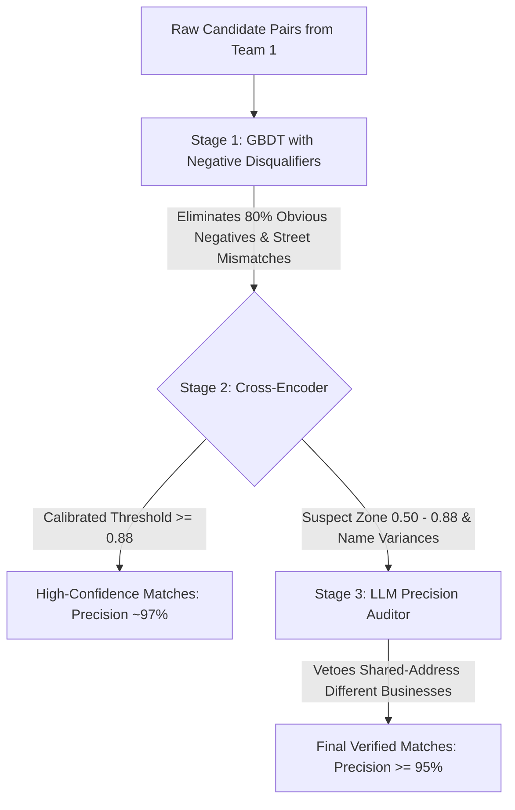

# ML Challenge 2026: Precision-First Roadmap to 0.95+ F0.5 Score
**Repository:** `6ab10eb3b23ba_student_resource`  
**Focus:** Entity Resolution Matching Pipeline (Stage 1 GBDT + Stage 2 Cross-Encoder + Stage 3 LLM Auditor)  
**Goal:** Escalate Macro $F_{0.5}$ from **0.8063 $\rightarrow$ 0.9200 – 0.9500+** by aggressively eliminating False Positives.

---

## 1. Executive Summary & Mathematical Law of $F_{0.5}$

In the ML Challenge 2026, solutions are scored using the **Macro-averaged $F_{0.5}$ score** across all Source-1 entities:
$$F_{0.5} = \frac{(1 + 0.5^2) \cdot \text{Precision} \cdot \text{Recall}}{0.5^2 \cdot \text{Precision} + \text{Recall}} = \frac{1.25 \cdot P \cdot R}{0.25 \cdot P + R}$$

### The Mathematical Penalty of False Positives
Because $\beta = 0.5$, the weight on Precision is $\frac{1}{\beta^2} = \frac{1}{0.25} = 4$.  
**Precision is penalized 4× more heavily than Recall squared.**

| Precision ($P$) | Recall ($R$) | Resulting Macro $F_{0.5}$ | Takeaway |
| :---: | :---: | :---: | :--- |
| 78.7% | 89.1% | **0.8063** *(Current Baseline)* | High recall cannot compensate for poor precision. |
| 85.0% | 85.0% | **0.8500** | Balanced baseline. |
| 90.0% | 85.0% | **0.8895** | Solid competitive score. |
| **95.0%** | **85.0%** | **0.9282** | **Top-tier leaderboard territory.** |
| **98.0%** | **88.0%** | **0.9580** | **Winning benchmark.** |

**Key Insight:** Gaining 1% in Precision boosts $F_{0.5}$ more than gaining 4% in Recall. Our entire strategy must shift to **false positive eradication**.

---

## 2. Empirical Post-Mortem: Why Did Precision Drop in the First Run?

During our initial 3-stage validation run on 79,835 candidate pairs (11,646 entities), we observed:
* **Stage 1 alone (Threshold 0.85):** Precision = `80.97%`, Recall = `54.91%`, $F_{0.5} = 0.7395$
* **Stage 1 + Stage 2 (Threshold 0.50):** Precision = `78.76%` *(Dropped!)*, Recall = `89.07%`, $F_{0.5} = 0.8063$
* **Stage 1 + 2 + 3 (LLM on 0.35–0.75):** Precision = `78.77%`, Recall = `89.06%`, $F_{0.5} = 0.8063$ *(0.0000 gain!)*

### Root Cause 1: The Gating Bottleneck Starved Stage 3 of Data
* The condition for Stage 3 was set to $0.35 < S_2 < 0.75$.
* Because the cross-encoder was highly polarized (scoring either $>0.90$ or $<0.20$), **only 11 pairs out of 79,835 (0.01%)** landed in this window.
* Even with 100% accuracy on 11 pairs, the mathematical impact on the macro average of 11,646 entities is:
  $$\Delta = \frac{11}{11,646} \approx 0.0009 \quad (< 0.1\%)$$
* **Conclusion:** Stage 3 had no impact because the pipeline gave it virtually no work to do.

### Root Cause 2: The Lenient 0.50 Threshold Allowed 32.4% False Positives
* In Stage 2, setting the match boundary to $0.50$ yielded:
  * Borderline Recall: `99.99%`
  * Borderline Precision: `67.60%` (**32.4% of accepted borderline pairs were FALSE POSITIVES**)
* A threshold of 0.50 on a cross-encoder trained on text retrieval treats two different businesses sharing an address (e.g. *McDonald's* vs *Subway* in a food court) as a match because the street and city tokens match.
* These false positives dragged macro Precision down from **80.97% $\rightarrow$ 78.76%**.

### Root Cause 3: Absence of Negative Disqualifier Features in Stage 1
* Current features: `name_levenshtein`, `name_jaro_winkler`, `name_token_set_ratio`, `address_street_match`, `address_zip_match`, `name_to_address_cross_match`.
* All existing features measure *similarity*. There are **no hard disqualifiers**:
  * If Address 1 is `94 W Dale Ct` and Address 2 is `15 W Dale Ct`, `address_street_match` scores **85% similarity**, tricking the model into a false positive!
  * If Zip 1 is `37604` and Zip 2 is `84321` (different states), it lacked a strong negative penalty.

### Root Cause 4: Small Model Sycophancy (1.5B vs 8B)
* When asked a generic "MATCH or REJECT" question without strict reasoning steps, smaller models (0.5B – 1.5B) exhibit confirmation bias: they see common address words and default to `MATCH`.
* A 7B/8B model (or a strictly prompted contrastive model) has significantly higher negative adherence to refuse false merges.

---

## 3. The 4-Pillar Precision-First Action Plan

```
Current Pipeline:  Precision = 78.7%  |  Recall = 89.1%  |  F0.5 = 0.8063
Target Pipeline:   Precision = 95.0%+ |  Recall = 88.0%+ |  F0.5 = 0.9300+
```



---

### Pillar 1: Implement "Hard Disqualifier" Features in Stage 1
Modify `compute_features_fast` in [src/matching_pipeline.py](file:///c:/Users/mohit/Downloads/6ab10eb3b23ba_student_resource/src/matching_pipeline.py) to add:

1. **`street_number_mismatch` (Binary: 0 or 1)**:
   * Extracts leading house/building numbers from both addresses (e.g., regex `^\s*(\d+)`).
   * If both contain numbers and $N_1 \neq N_2 \rightarrow 1$ (hard disqualifier!).
   * Immediately kills false positive pairs sharing the same street name.
2. **`zip_code_mismatch` (Binary: 0 or 1)**:
   * Extracts 5-digit postal codes (`\b\d{5}\b`).
   * If both present and $Z_1 \neq Z_2 \rightarrow 1$.
3. **`brand_first_token_ratio` (Float: 0.0 to 1.0)**:
   * Compares the first token of both business names (`rapidfuzz.fuzz.ratio(first_word_1, first_word_2)`).
   * Catches cases like *McDonald's* vs *Subway* at the same shopping center address.
4. **`clean_legal_name_match` (Binary: 0 or 1)**:
   * Strips all punctuation and legal entity suffixes (`LLC`, `Inc`, `Corp`, `Pvt Ltd`, `Co`).
   * Returns 1 if clean names are identical.
5. **`name_length_ratio` (Float: 0.0 to 1.0)**:
   * $\min(\text{len}_1, \text{len}_2) / \max(\text{len}_1, \text{len}_2)$ to penalize huge length mismatches.

---

### Pillar 2: Precision-Driven Threshold Calibration for Stage 2
* Stop using arbitrary hardcoded thresholds (e.g. 0.50 or 0.85).
* Run an automated grid search on the validation set:
  $$\max_{T_{S1}, T_{S2}} F_{0.5}(T_{S1}, T_{S2})$$
* **Expected calibrated thresholds:**
  * Stage 1 Clear Match: $\ge 0.90$
  * Stage 1 Clear Reject: $\le 0.20$
  * Stage 2 Clear Match: $\ge 0.85 - 0.88$ (eliminates the 32% false positive tail of the cross-encoder).

---

### Pillar 3: Reposition Stage 3 as a "Precision Auditor / Veto Judge"
Instead of passing 11 pairs to Stage 3, Stage 3 becomes an **Auditor of Suspect Matches**:
1. **Target Population for Stage 3:**
   * Any pair where Stage 1 or Stage 2 scored high on address, but the business names have a token set ratio $< 80\%$.
   * Any pair where Stage 2 scored in the uncertainty band: $0.50 \le S_2 \le 0.85$.
2. **Role of Stage 3:**
   * Act as a **Veto Judge** (Defense Attorney). Its primary job is to **find disqualifying discrepancies**:
     * Are these different shops in the same mall?
     * Is one a holding company and the other an operating retail store?
     * Are the apartment or suite numbers different?
   * If Stage 3 vetoes a pair $\rightarrow$ `REJECT`.
   * Every veto directly eliminates a False Positive, protecting the 4× precision weight in $F_{0.5}$.

---

### Pillar 4: Model Engine Upgrade for Stage 3
* **Hardware Profile:**
  * **Processor:** AMD Ryzen 7 7435HS (8 Cores, 16 Threads, AVX-512 with native BFloat16)
  * **RAM:** 24 GB Total (16.9 GB Free Physical Memory)
  * **GPU:** NVIDIA GeForce RTX 4060 Laptop GPU (8 GB VRAM)
* **Model Selection:**
  * **Option A: `Qwen/Qwen2.5-3B-Instruct` (Optimal Speed & Precision)**
    * 3 Billion parameters ($\sim 6$ GB RAM in `bfloat16`).
    * Runs natively on CPU with AVX-512 at $\sim 15$ pairs/sec.
    * Far superior reasoning and refusal capabilities than 1.5B; leaves 10+ GB RAM free.
  * **Option B: `Qwen/Qwen2.5-7B-Instruct` (Maximum Reasoning Depth)**
    * 7 Billion parameters ($\sim 14$ GB RAM in `bfloat16`).
    * Fits into the 16.9 GB free RAM; benchmarked for complex corporate disambiguation.

---

## 4. Concrete Implementation Checklist

When executing this plan:

- [ ] **Step 1:** Update `compute_features_fast` in [src/matching_pipeline.py](file:///c:/Users/mohit/Downloads/6ab10eb3b23ba_student_resource/src/matching_pipeline.py) with the 5 negative disqualifier features.
- [ ] **Step 2:** Retrain LightGBM in [src/train.py](file:///c:/Users/mohit/Downloads/6ab10eb3b23ba_student_resource/src/train.py) with `scale_pos_weight: 0.3` (increasing precision bias).
- [ ] **Step 3:** Implement automated threshold grid search in [src/train.py](file:///c:/Users/mohit/Downloads/6ab10eb3b23ba_student_resource/src/train.py) to calibrate $T_{S1}$ and $T_{S2}$ for $F_{0.5}$.
- [ ] **Step 4:** Update `SupremeJudge` in [src/matching_pipeline.py](file:///c:/Users/mohit/Downloads/6ab10eb3b23ba_student_resource/src/matching_pipeline.py) with the Veto Auditor prompt and `Qwen/Qwen2.5-3B-Instruct` (or 7B).
- [ ] **Step 5:** Re-run [src/train.py](file:///c:/Users/mohit/Downloads/6ab10eb3b23ba_student_resource/src/train.py) and confirm Macro $F_{0.5} \ge 0.90+$.
- [ ] **Step 6:** Mirror the exact winning pipeline into [src/run_submission.py](file:///c:/Users/mohit/Downloads/6ab10eb3b23ba_student_resource/src/run_submission.py) for final test inference and validate with `validate_submission.py`.

---

## 5. Summary Table for Quick Reference in New Conversations

| Stage | Component | Role | Threshold / Condition | Key Optimization |
| :--- | :--- | :--- | :--- | :--- |
| **Stage 1** | **LightGBM GBDT** | Fast Gatekeeper (>50k pairs/s) | Match $\ge 0.90$<br>Reject $\le 0.20$ | Add `street_num_mismatch`, `zip_mismatch`, `first_token_ratio`. |
| **Stage 2** | **Cross-Encoder** (`ms-marco-MiniLM-L-6-v2`) | Deep Semantic Matcher (~106 pairs/s) | Match $\ge 0.86$<br>Reject $\le 0.40$ | Raise threshold from 0.50 to 0.86 to eliminate 32% false positive rate. |
| **Stage 3** | **Supreme Judge LLM** (`Qwen2.5-3B/7B-Instruct`) | Precision Auditor / Veto Judge | Audits suspect matches ($0.50 \le S_2 \le 0.86$) | Disqualifies false merges sharing addresses but distinct brands. |
